<a href = "#01">Program-01</a> <br>
<a href = "#02">Program-02</a> <br>
<a href = "#03">Program-03</a> <br>
<a href = "#04">Program-04</a> <br>
<a href = "#05">Program-05</a> <br>
<a href = "#06">Program-06</a> <br>
<a href = "#07">Program-07</a> <br>
<a href = "#08">Program-08</a> <br>
<a href = "#09">Program-09</a> <br>
<a href = "#10">Program-10</a> <br>
<a href = "#11">Program-11</a> <br>
<a href = "#12">Program-12</a> <br>
<a href = "#13">Program-13</a> <br>
<a href = "#14">Program-14</a> <br>
<a href = "#15">Program-15</a> <br>
<a href = "#16">Program-16</a> <br>
<a href = "#17">Program-17</a> <br>
<a href = "#18">Program-18</a> <br>
<a href = "#19">Program-19</a> <br>
<a href = "#20">Program-20</a> <br>
<a href = "#21">Program-21</a> <br>
<a href = "#22">Program-22</a> <br>
<a href = "#23">Program-23</a> <br>
<a href = "#24">Program-24</a> <br>
<a href = "#25">Program-25</a> <br>
<a href = "#26">Program-26</a> <br>
<a href = "#27">Program-27</a> <br>
<a href = "#28">Program-28</a> <br>
<a href = "#29">Program-29</a> <br>
<a href = "#30">Program-30(Pep-Coding)</a> <br>


<h2 id = "01">Program-01</h2>


```cpp
//Using For-Loop.
#include<iostream>
using namespace std;

int main()
{
    for(int  i =0; i < 5; i++)
    {
        for(int j = 0; j < i+1; j++)
        {
            cout << "*" << " ";
        }
        cout << endl;
    }
    return 0;
}

//Using While-Loop.
#include<iostream>
using namespace std;

int main()
{
    int i = 0;
    while(i < 5)
    {
        int j = 0;
        while (j < i+1)
        {
           cout << "*" << " ";
           j++;
        }        
        cout << endl;
        i++;
    }
    return 0;
}
```

<h2 id = "02">Program-02</h2>


```cpp
//Using the For-Loop
#include<iostream>
using namespace std;

int main()
{
    for(int i = 0; i < 5; i++)
    {
        for(int j =  0; j < 5; j++)
        {
            if( j < 5- (i+1)){
                cout << " ";
            }

            else{
                cout << "*";
            }            
        }

        cout<<endl;
    }
    return 0;
}


//Using the While-Loop
#include<iostream>
using namespace std;

int main()
{
    int i = 0;
    while(i < 5){
        int j = 0;
        while(j < 5){
            if(j < 5-(i+1)){
                cout << " ";
            }
            
            else{
                cout << "*";
            }
            
            j++;
        }
        cout<<endl;
        i++;
    }
    return 0;
}
```

<h2 id = "03">Program-03</h2>


```cpp
//Using For-Loop
#include<iostream>
using namespace std;

int main()
{
    for(int  i = 0; i < 5; i++ )
    {
        for(int j = 5-i; j > 0; j--)
        {
            cout << "*";
        }

        cout << endl;
    }
    return 0;
}


//Using While-Loop
#include<iostream>
using namespace std;

int main()
{
    int i = 0;
    while(i < 5)
    {
        int j = 5-i;
        while(j > 0)
        {
            cout << "*";
            j--;
        }
        cout << endl;
        i++;
    }
    return 0;
}
```
<h2 id = "04">Program-04</h2>


```cpp
//Using the For-Loop
#include<iostream>
using namespace std;

int main()
{
    for(int i = 0; i < 5; i++)
    {
        for(int j = 0; j < 5; j++)
        {
            if(j >= i){
                cout << "*";
            }

            else{
                cout << " ";
            }
        }
        cout << endl;
    }
    return 0;
}


//Using the While-Loop
#include<iostream>
using namespace std;

int main()
{
    int i = 0;
    while(i < 5)
    {
        int j = 0;
        while (j < 5)
        {
            if(j >= i){
                cout << "*";
            }

            else{
                cout << " ";
            }
            j++;
        }
        
        cout << endl;
        i++;
    }
    return 0;
}
```

<h2 id = "05">Program-05</h2>


```cpp
//Using the For-Loop
#include<iostream>
using namespace std;

int main()
{
    for(int i = 0; i < 5; i++)
    {
        for(int j = 0; j < i+1; j++)
        {
            cout << (i+1) << " ";
        }

        cout << endl;
    }
    return 0;
}


//Using the While-Loop
#include<iostream>
using namespace std;

int main()
{
    int i = 0;
    while(i < 5)
    {
        int j = 0;
        while(j < i+1)
        {
            cout << (i+1);
            j++;
        }
        cout << endl;
        i++;
    }
}
```

<h2 id = "06">Program-06</h2>


```cpp
//FLOYD'S TRIANGLE.

//Using For-Loop.
#include<iostream>
using namespace std;

int main()
{
    int i = 0;
    int k = i+1;
    
    for(i; i < 5; i++)
    {        
        for(int  j = 0; j < i+1 ; j++)
        {
            cout << k++ << " ";
        }
        cout << endl;
    }
    return 0;
}


//Using While-Loop.
#include<iostream>
using namespace std;

int main()
{
    int i = 0;
    int  k = (i+1);

    while(i < 5)
    {
        int j = 0;
        while(j < i+1)
        {
            cout << k++ << " "; 
            j++;
        }
        cout << endl;
        i++;
    }

    return 0;
}
```

<h2 id = "07">Program-07</h2>


```cpp
//Using For-Loop.
#include<iostream>
using namespace std;

int main()
{
    char c = 'A';
    for(int  i = 0; i < 5; i++)
    {
        for(int j = 0; j < i+1; j++)
        {
            cout << c++ << " ";
        }
        cout << endl;
    }
    return 0;
}


//Using while-Loop.
#include<iostream>
using namespace std;

int main()
{
    char c = 'A';
    int i = 0;
    while(i < 5)
    {
        int j = 0;
        while(j < i+1)
        {
            cout << c++ << " ";
            j++;
        }
        cout << endl;
        i++;
    }
    return 0;
}
```

<h2 id = "08">Program-08</h2>


```cpp
//Using For-Loop
#include<iostream>
using namespace std;

int main()
{
    char c = 'A';
    for(int i = 0; i < 5; i++)
    {
        for(int j = 0; j < i+1; j++)
        {
            cout << c << " ";
        }
        cout << endl;
        c++;
    }
  
    return 0;
}

//Using While-Loop
#include<iostream>
using namespace std;

int main()
{
    char c = 'A';
    int i = 0;
    while(i < 5)
    {
        int j = 0;
        while(j < i+1)
        {
            cout << c << " ";
            j++;
        }
        cout << endl;
        c++;
        i++;
    }
    return 0;
}
```

<h2 id = "09">Program-09</h2>


```cpp
//Using For-Loop.
#include<iostream>
using namespace std;

int main()
{
    for(int i = 0; i < 5; i++)
    {
        for(int j =  0; j < 5; j++)
        {
            if( j < 5- (i+1)){
                cout << " ";
            }

            else{
                cout << "*" <<" ";
            }            
        }

        cout<<endl;
    }
    return 0;
}

//Using The While-Loop.
#include<iostream>
using namespace std;

int main()
{
    int i = 0;
    while (i < 5)
    {
        int  j = 0;
        while (j < 5)
        {
            if(j < 5-(i+1)){
                cout << " ";
            }

            else{
                cout << "*" <<" ";
            }

            j++;
        }
        
        i++;
        cout << endl;
    }
    
    return 0;
}
```

<h2 id = "10">Program-10</h2>


```cpp
//Using For-Loop.
#include<iostream>
using namespace std;

int main()
{
    for(int i = 0; i < 5; i++)
    {
        for(int j = 0; j < 5; j++)
        {
            if(j < i){
                cout << " ";
            }

            else{
                cout << "*" << " ";
            }
        }
        cout << endl;
    }
    return 0;
}

//Another Approach
#include<iostream>
using namespace std;

int main()
{
    for(int i = 1; i <= 5; i++)
    {
        for(int  j = 1; j < i; j++)         //For Printing the space infront.
        {
            cout << " ";
        }

        for(int k = 0; k <= (5-i); k++)         // For Pritnting the inverted Pyramid.
        {
            cout << "* ";
        }
       cout <<  endl;
    }

    return 0;
}

//Using While-Loop.
#include<iostream>
using namespace std;

int main()
{
    int i = 0;
    while(i < 5)
    {
        int j = 0;
        while (j < 5)
        {
            if(j >= i){
                cout << "*" << " ";
            }

            else{
                cout << " ";
            }
            j++;
        }
        
        cout << endl;
        i++;
    }
    return 0;
}
```
<h2 id = "11">Program-11</h2>


```cpp

//Using For-Loop
#include<iostream>
using namespace std;

int main()
{
    for(int i = 0; i < 5; i++)
    {
        for(int j = 0; j < 5; j++)
        {
            cout << "* ";
        }
        cout << endl;
    }
    return 0;
}   

//Using While-Loop
#include<iostream>
using namespace std;

int main()
{
    int i = 0;
    while(i <5)
    {
        int j = 0;
        while(j < 5)
        {
            cout << "* ";    
            j++;        
        }

        i++;
        cout << endl;
    }
    return 0;
}
```
<h2 id = "12">Program-12</h2>


```cpp
// Using For-Loop
#include<iostream>
using namespace std;

int main()
{
    for(int i = 0; i < 5; i++)
    {
        for(int  j = 0; j < 5; j++ )
        {
            if(i == 0 || i == 4)
            {
                cout << "* ";       //one space is provided after each character print.
            }

            else{
                if(j == 0 || j == 4)
                {
                    cout << "* ";     //one space is provided after each character print.
                }

                else{
                    cout << "  ";   //two spaces are provided here (Similar to above situation where one space is provided after each character print)
                }
            }
        }

        cout << endl;
    }
    return 0;
}

//Using While-Loop
#include<iostream>
using namespace std;

int main()
{
    int i = 0;
    while(i < 5)
    {
        int  j = 0;
        while(j < 5) 
        {
            if(i == 0 || i == 4)
            {
                cout << "* ";
            }

            else{
                if(j == 0 || j == 4)
                {
                    cout << "* ";
                }

                else{
                    cout << "  ";
                }
            }
            j++;             
        }

        i++;
        cout << endl;
    }
    return 0;
}

```

<h2 id = "13">Program-13</h2>


```cpp
// USing For-Loop
#include<iostream>
using namespace std;

int main()
{
    for(int i = 0; i < 5; i++)
    {
        for(int j = 0; j <= (4-i); j++)
        {
            if(i == 0 || i == 4)
            {
                cout << "* ";
            }

            else{
                if(j == 0 || j == (4-i))
                {
                    cout << "* ";
                }

                else{
                    cout << "  ";
                }
            }
        }
        cout << endl;
    }
    return 0;
}

// Using While-Loop
#include<iostream>
using namespace std;

int main()
{
    int i = 0;
    while(i < 5)
    {
        int j = 0;
        while(j <= (4-i))
        {
            if(i == 0 || i == 4)
            {
                cout << "* ";
            }

            else{
                if(j == 0 || j == (4-i))
                {
                    cout << "* ";
                }

                else{
                    cout << "  ";
                }
            }

            j++;
        }
        i++;
        cout << endl;
    }
    return 0;
}
```
<h2 id = "14">Program-14</h2>


```cpp
// Using For-Loop
#include<iostream>
using namespace std;

int main()
{
    for(int i = 0; i < 5; i++)
    {
        for(int j = 0; j < 9; j++)
        {

                if( j < 5 && i == 4)          //for printing the last line only
                {
                    cout << "* ";
                }

                else if(j == (5-(i+1)) && i < 4)         //For Printing the first line and first stars
                {
                    cout << "*";
                }

                else if(j == (4+i) && i > 0 && i != 4){  //for printing the last stars 
                    cout << "*";                   
                }
                       

                else{
                    cout << " ";            //For Printing the spaces in front and creating hollow inside the pyramid
                }
            }
        
        cout << endl;
    }
    return 0;
}

// Uing While-Loop

#include<iostream>
using namespace std;

int main()
{
    int  i = 0;
    while(i < 5)
    {
        int j = 0;
        while(j < 9)
        {
            if(j < 5 && i == 4)     //For Printing the Last line only.
            {
                cout << "* ";
            }

            else if(j == (5-(i+1))&& i < 4)   //For Printing the first line and first stars.
            {
                cout << "*";
            }

            else if(j == (4+i) && i > 0 && i != 4)      //For printing the last stars.
            {
                cout << "*";
            }

            else{                   //For printing the spaces in front and in the hollow space inside the pyramid.
                cout << " ";
            }
            j++;
        }
        i++;
        cout << endl;
    }
    return 0;
}


```


<h2 id = "15">Program-15</h2>


```cpp
// Using For-Loop
#include<iostream>
using namespace std;

int main()
{
    for(int i = 0; i < 5; i++)
    {
        for(int j = 0; j < i; j++)
        {
            cout << (j+1) << " ";
        }
        cout << endl;
    }
    return 0;
}

//Using While-Loop
#include<iostream>
using namespace std;

int main()
{
    int i = 0;
    while(i < 5)
    {
        int j = 0;
        while(j < i+1)
        {
            cout << (j+1) << " ";
            j++;
        }
        i++;
        cout << endl;
    }
    return 0;
}
```

<h2 id = "16">Program-16</h2>


```cpp
// Using the For-Loop
#include<iostream>
using namespace std;

int main()
{
    for(int i = 0; i < 5; i++)
    {
        for(int j = 0; j < (5-i); j++)
        {
            cout << (j+1) << " ";
        }

        cout << endl;
    }
    return 0;
}

// Using the While-Loop
#include<iostream>
using namespace std;

int main()
{
    int i = 0;
    while(i < 5)
    {
        int j = 0;
        while(j < (5-i))
        {
            cout << (j+1) << " ";
            j++;
        }
        i++;
        cout <<endl;
    }
    return 0;
}
```
<h2 id = "17">Program-17</h2>


```cpp
// Using the For-Loop
#include<iostream>
using namespace std;

int main()
{
    for(int i = 0; i < 5; i++)
    {
        for(int j = 0; j < 9; j++)
        {
            if(j < 5 && i == 4)     //For printing the Last Line only.
            {
                cout << (j+1) << " ";
            }

            else if(j == 0  && i != 4)          //For printing the First Characters.
            {
                cout << (j+1);
            }

            else if(j == (2*i) && i > 0 && i != 4 )       //For printing the Last Characters.
            {
                cout << (i+1);
            }

            else{
                cout << " ";
            }
        }
        cout << endl;
    }
    return 0;
}

// Using While-Loop
#include<iostream>
using namespace std;

int main()
{
    int i = 0;
    while(i < 5)
    {
        int  j = 0;
        while(j < 9)
        {
            if(j < 5 && i == 4)        //For Printing the last line only.
            {
                cout << (j+1) << " ";
            }

            else if(j == 0 && i != 4)           //For Printing the first characters only. 
            {
                cout << (j+1);
            }

            else if(j == (2*i) && i > 0 && i != 4)       //For Printing the last characters only.
            {
                cout << (i+1);
            }

            else{
                cout << " ";
            }
            j++;
        }
        i++;
        cout <<endl;
    }
    return 0;
}
```
<h2 id = "18">Program-18</h2>


```cpp
// Using For-Loop
#include<iostream>
using namespace std;

int main()
{
    for(int i = 0; i < 5; i++)
    {
        for(int j = 0; j < 9; j++)
        {
            if(i == 4 && j < 5)    //For printing the last line only.
            {
                cout << (j+1) << " ";
            }

            else if(j == (5-(i+1)) && i != 4)   //For Printing the First Characters.
            {
                cout << "1";
            }

            else if(j == (4+i) && i > 0 && i != 4)   //For Printing the Last Characters.
            {
                cout << (i+1);
            }

            else{
                cout << " ";        //For printing the space infront and for creating the hollow inside.
            }
        }
        cout << endl;
    }
    return 0;
}

// using While-Loop

#include<iostream>
using namespace std;

int main()
{
    int i = 0; 
    while(i < 5)
    {
        int j = 0;
        while(j < 9)
        {
            if(j < 5 && i == 4)        //For Printing Last Line only.
            {
                cout << (j+1) << " ";
            }

            else if(j == (5-(i+1)) && i != 4)       //For Printing the First Characters.
            {
                cout << "1";
            }

            else if(j == (4+i) && i > 0 && i != 4)       //For Printing the Last Characters.
            {
                cout << (i+1);
            }

            else{               //For Printing the Space infront and creating hollow inside of the pyramid.
                cout << " ";
            }
            j++;
        }
        i++;
        cout <<endl;
    }
    return 0;
}
```

<h2 id = "19">Program-19</h2>

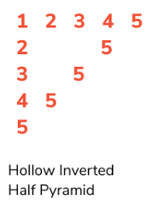
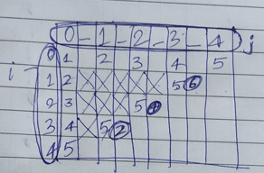

```cpp
// Using the For-Loop
#include<iostream>
using namespace std;

int main()
{
    for(int i = 0; i < 5; i++)
    {
        for(int j = 0; j < 9; j++)
        {
            if(i == 0 && j < 5)     //For Printing the First Line only.
            {
                cout << (j+1) << " ";
            }

            else if(j == 0 && i > 0)           //For Printing the First characters only.
            {
                cout << (i+1);
            }

            else if(j == (8-(2*i)) &&i > 0 && i != 4)           //For Printing the last characters only.
            {
                cout << "5";
            }

            else{               //For creating hollow space inside the Pyramid
                cout << " ";
            }
        }
        cout << endl;
    }
    return 0;
}

// Using the While-Loop
#include<iostream>
using namespace std;

int main()
{
    int  i = 0;
    while(i < 5) 
    {
        int j = 0 ;
        while(j < 9)
        {
            if(j < 5 && i == 0)            //For Printing the First Line only.
            {
                cout << (j+1) << " ";
            }

            else if(j == 0 && i > 0)       //For Printing the first characters only.
            {
                cout << (i+1);
            }

            else if(j == (8-(2*i)) && i > 0 && i != 4)        //For Printing the Last characters only.
            {
                cout << "5";
            }

            else{               //For creating the hollow space inside the Pyramid.
                cout << " ";
            }

            j++;
        }
        i++;
        cout << endl;
    }
    return 0;
}
```
<h2 id = "20">Program-20</h2>

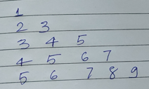

```cpp
// Using For-Loop
#include<iostream>
using namespace std;

int main()
{
    for(int  i = 1; i <= 5; i++)
    {
        int k = i;
        for(int  j = 1; j <= i; j++)
        {
            cout << k++ << " ";
        }
       
        cout << endl;
    }
    return 0;
}

// Using While-Loop
#include<iostream>
using namespace std;

int main()
{
    int  i = 1;
    while(i <= 5)
    {
        int  k = i;
        int  j = 1;
        while(j <= i)
        {
            cout << k++ << " ";
            j++;
        }
        i++;
        cout << endl;
    }
    return 0;
}
```

<h2 id = "21">Program-21</h2>

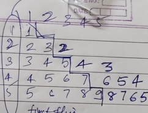

```cpp
// Using For-Loop
#include<iostream>
using namespace std;

int main()
{
    for(int  i = 1; i <= 5; i++)
    {
        int k = i;
        for(int  j = 1; j <= i; j++)
        {
            cout << k++ << " ";
        }

        for(int l = (k-2) ; l >= i; l--)
        {
            cout << l << " ";
        }

        cout << endl;
    }
    return 0;
}

//Using While-Loop
#include<iostream>
using namespace std;

int main()
{
    int i  = 1;
    while(i <= 5)
    {
        int k = i;
        int j = 1;
        while(j <= i)
        {
            cout << k++ << " ";
            j++;
        }

        int l = (k-2);
        while(l >= i)
        {
            cout << l << " ";
            l--;
        }
        i++;
        cout << endl;
    }
    return 0;
}
```
<h2 id = "22">Program-22</h2>

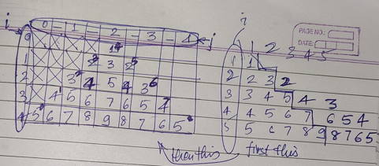

```cpp
// Using the For-Loop
#include<iostream>
using namespace std;

int main()
{
    for(int i = 1; i <= 5; i++)
    {
        int  k = i;

        for(int j = 1; j <= (5-i); j++)    //For Printing the space infront.
        {
            cout << "  ";       //Note that two spaces is provided here to make the pyramid symmetrical.
        }

        for(int l = 1; l <= i; l++)                 //For Printing the  half pyramid
        {
            cout << k++ << " ";
        }

        for(int m = (k-2); m >= i; m--)         //For printing the reverse half of the pyramid.
        {
            cout << m << " ";
        }   
       
        cout << endl;
    }
    return 0;
}

// Using While-Loop
#include<iostream>
using namespace std;

int main()
{
    int  i = 1;
    while(i <= 5)
    {
        int  k = i;

        int j = 1;
        while(j <= (5-i))           //For Printing the spaces infront.
        {
            cout << "  ";
            j++;
        }

        int l = 1;
        while(l <= i)           //For Printing the first half of the Pyramid.
        {
            cout << k++ << " ";
            l++;
        }

        int m = (k-2);
        while(m >= i)
        {
            cout << m << " ";
            m--;
        }

        i++;
        cout << endl;
    }
    return 0;
}
```
<h2 id = "23">Program-23</h2>

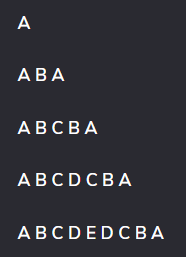

```cpp
// Using For-Loop
#include<iostream>
using namespace std;

int main()
{
    for(int i = 1; i <=5; i++)
    {
        for(char j = 1; j <= i; j++)
        {
            cout << char(j+(65-1)) << " ";
        }

        for(int k = (i-1); k >= 1; k--)
        {
            cout << char(k+(65-1)) << " ";
        }
        cout << endl;
    }
    return 0;
}

// Using While-Loop
#include<iostream>
using namespace std;

int main()
{
    int i = 1;
    while(i <= 5)
    {
        int j = 1;
        while(j <= i)
        {
            cout << char(j + (65-1)) << " ";
            j++;
        }

        int k = (i-1);
        while(k >= 1)
        {
            cout << char(k + (65-1)) << " ";
            k--; 
        }
        i++;
        cout << endl;
    }
    return 0;
}
```

<h2 id = "24">Program-24</h2>

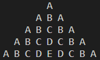

```cpp
// Using For-loop
#include<iostream>
using namespace std;

int main()
{
    for(int i = 1; i <= 5; i++)
    {
        for(int j = (5-i); j >= 1; j--)     //For Printing the Space infront
        {
            cout << "  ";         //Note that "two-spaces" are provided here. 
        }

        for(int j = 1; j <= i; j++)         //For Printing the First half of the Pyramid.
        {
            cout << char(j + (65 - 1)) << " ";
        }

        for(int k = (i-1); k >= 1; k--)
        {
            cout << char(k + (65 - 1)) << " ";
        }

        cout << endl;
    }
    return 0;
}

// Using While-Loop
#include<iostream>
using namespace std;

int main()
{
    int i = 1;
    while(i <= 5)
    {
        int j = (5-i);
        while(j >= 1)           //For Printing space infront
        {
            cout << "  ";
            j--;
        }

        int k = 1;
        while(k <= i)               //For Printing the First half of the pyramid.
        {
            cout << char(k + (65 - 1)) << " ";
            k++;
        }

        int  l = (i-1);
        while(l >= 1)
        {
            cout << char(l + (65 -1)) << " ";
            l--;
        }
        i++;
        cout << endl;
    }
    return 0;
}
```
<h2 id = "25">Program-25</h2>

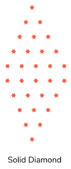

```cpp
// DIAMOND PATTERN PROGRAM

// Using For-Loop
#include<iostream>
using namespace std;

int main()
{
    for(int i = 1; i <= 5; i++)
    {
        for(int j = 1; j <= (5-i); j++)     //For Printing spaces infront.
        {
            cout << " ";
        }

        for(int k = 1; k <= i; k++)     //For Printing Pyramid
        {
            cout << "* ";
        }
        cout << endl;
    }

    for(int i = 1; i <= 5; i++)
    {
        for(int j = 1; j < i; j++)     //For Printing spaces infront.
        {
            cout << " ";
        }

        for(int k = 0; k <= (5-i); k++)         //For Printing inverted pyramid
        {
            cout << "* ";
        }
        cout << endl;
    }
    return 0;
}

// Using While-Loop
#include<iostream>
using namespace std;

int main()
{
    int i = 1;
    while(i <= 5)
    {
        int j = 1;
        while(j <= (5-i))       //For Printing the spaces infront
        {
            cout << " ";
            j++;
        }

        int k = 1;
        while(k <= i)       //For printing the pyramid
        {
            cout << "* ";
            k++;
        }
        i++;
        cout << endl;
    }

    int l = 1;
    while(l <= 5)
    {
        int j = 1;
        while(j < l)            //For Printing the spaces infront.
        {
            cout << " ";
            j++;
        }

        int k = 0;
        while(k <= (5-l))           //For printing the inverted pyramid.
        {
            cout << "* ";
            k++;
        }
        l++;
        cout << endl;
    }
    return 0;
}
```
<h2 id = "26">Program-26</h2>

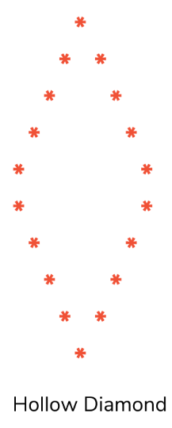

```cpp
//HOLLOW DIAMOND PATTERN

// Using For-Loop
#include<iostream>
using namespace std;

int main()
{
    //For Printing the hollow pyramid
    for(int i = 1; i <= 5; i++)
    {
        for(int j = 1; j < 10; j++)
        {

            if( j == (5- (i - 1)))           //For Printing the First characters only.
            {
                cout << "*";
            }

            else if(i > 1 && j == (5 + (i -1)))           //For Printing the Last characters only.
            {
                cout << "*";
            }

            else{
                cout << " ";
            }
        }

        cout << endl;
    }

    //For Printing the Hollow inverted Pyramid
    for(int i = 1; i <= 5; i++)
    {
        for(int j = 1; j < 10; j++)
        {

            if( j == i)           //For Printing the First characters only.
            {
                cout << "*";
            }

            else if(i != 5 && j == (10-i))           //For Printing the Last characters only.
            {
                cout << "*";
            }

            else{
                cout << " ";
            }
        }

        cout << endl;
    }
    return 0;
}

//Using While loop
#include<iostream>
using namespace std;

int main()
{
    int i = 1;
    while(i <= 5)
    {
        int j = 1;
        while(j < 10)
        {
            if(j == (5 - (i - 1)))        //For printing the First characters.
            {
                cout << "*";
            }

            else if(j == (5 + (i - 1)) && i > 1)           // For printing the Last characters.
            {
                cout << "*";
            }

            else{
                 cout << " ";
            }
            j++;
        }
        i++;
        cout << endl;
    }
    
    int l = 1;
    while(l <= 5)
    {
        int j = 1;
        while(j < 10)
        {
            if(j == l)        //For printing the First characters.
            {
                cout << "*";
            }

            else if(j == (10 - l) && l != 5)           // For printing the Last characters.
            {
                cout << "* ";
            }

            else{
                 cout << " ";
            }
            j++;
        }
        l++;
        cout << endl;
    }
    return 0;
}
```
<h2 id = "27">Program-27</h2>

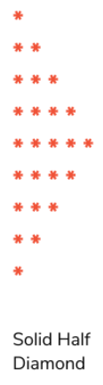

```cpp
//SOLID HALF DIAMOND

// Using For-Loop
#include<iostream>
using namespace std;

int main()
{
    for(int i = 1; i <= 5; i++)         //For Printing the Upper half Pyramid
    {
        for(int j = 1; j <= i; j++)
        {
            cout << "* ";
        }
        cout << endl;
    }

    for(int i = 1; i <= 5; i++)             //For Printing the lower inverted half pyramid
    {
        for(int j = 1; j <= (5 - i); j++)
        {
            cout << "* ";
        }
        cout << endl;
    }
    return 0;
}

// Using the While-Loop
#include<iostream>
using namespace std;

int main()
{
    int i = 1;
    while(i <= 5)
    {
        int j = 1;
        while(j <= i)       //For Printing the Upper half pyramid.
        {
            cout << "* ";
            j++;
        }

        
        i++;
        cout << endl;
    }
    int l = 1;
    while(l <= 5)
    {
        int k = 1;
        while(k <= (5-l))       //For Printing the lower half inverted pyramid.
        {
            cout << "* ";
            k++;
        }        
        l++;
        cout << endl;
    }
    return 0;
}
```
<h2 id = "28">Program-28</h2>

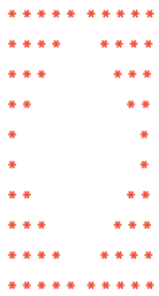

```cpp
// Using For-Loop
#include<iostream>
using namespace std;

int main()
{
    //For the upper half
    for(int i = 1; i <= 5; i++)
    {
        for(int j = 1; j <= (5 - (i - 1)); j++)
        {
            cout << "* ";
        }

        for(int k = 1; k <= i; k++)
        {
            cout << "  ";   //Two Spaces are provided here
        }

        for(int l = 1; l <= (i-1); l++)
        {
            cout << "  ";   //Two Spaces are provided here
        }

        for(int l = 1; l <= (5 - (i - 1)); l++)
        {
            cout << "* ";
        }
        cout << endl;
    }


    //For the Lower half
    for(int i = 1; i <= 5; i++)
    {
        for(int j = 1; j <= i; j++)
        {
            cout << "* ";
        }

        for(int k = 1; k <= (5 - (i - 1)); k++)
        {
            cout << "  ";   //Two Spaces are provided here
        }

        for(int l = 1; l <= (5 - i); l++)
        {
            cout << "  ";   //Two Spaces are provided here
        }

        for(int l = 1; l <= i; l++)
        {
            cout << "* ";
        }
        cout << endl;
    }
    return 0;
}
```

<h2 id = "29">Program-29</h2>

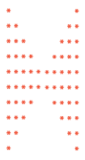

```cpp
// BUTTERFLY PATTERN PROGRAM

// Using For-Loop
#include<iostream>
using namespace std;

int main()
{
    //For Printing the Upper Pattern.
    for(int i = 1; i <= 5; i++)
    {
        for(int j = 1; j <= i; j++)     //For Printing the first upper half of the pattern.
        {
            cout << "* ";
        }

        for(int k = 1; k <= (5 - i); k++)       //For Printing the first half of the hollow Pattern Inside.
        {
            cout << "  ";   //Note that two spaces are provided here.
        }

        for(int l = 1; l <= (5 - i); l++)       //For Printing the first half of the hollow Pattern Inside.
        {
            cout << "  ";       //Note that two spaces are provied here.
        }

        for(int m = 1; m <= i; m++)     //For Printing the Second Upper Half of the pattern.
        {
            cout << "* ";
        }

        cout << endl;
    }

    //For Printing the Lower Pattern
    for(int i = 1; i <= 5; i++)
    {
        for(int j = 1; j <= (5 - (i - 1)); j++)     //For Printing the first lower half of the pattern.
        {
            cout << "* ";
        }

        for(int k = 1; k < i; k++)      //For Printing the first half of the hollow Pattern Inside.
        {
            cout << "  ";           //Note that two spaces are provied here.
        }

        for(int l = 1; l < i; l++)      //For Printing the first half of the hollow Pattern Inside.
        {
            cout << "  ";           //Note that two spaces are provied here.
        }

        for(int m = 1; m <= (5 - (i - 1)); m++)     //For Printing the second lower half of the pattern.
        {
            cout << "* ";
        }

        cout << endl;
    }
    return 0;
}
```

<h2 id = "30">Program-30(Pep-Coding)</h2>

.png)

```cpp
#include<iostream>
using namespace std;
int main(){
        
    int n;
    cin >> n;

    int st = 3, sp = 2;
    
    for(int i = 1; i <= n; i++){

        for(int j = 1; j <= st; j++){
            cout << "* ";
        }
        for(int i = 1; i <= sp; i++){
            cout << "  ";
        }
        for(int j = 1; j <= st; j++){
            cout << "* ";
        }

        if(i <= n/2){
            st--;
            sp += 2;
        }else{
            st++;
            sp -= 2;
        }

        cout << endl;
    }
    
}

```
