<a href = "#01">Program-01</a> <br>
<a href = "#02">Program-02</a> <br>
<a href = "#03">Program-03</a> <br>
<a href = "#04">Program-04</a> <br>
<a href = "#05">Program-05</a> <br>
<a href = "#06">Program-06</a> <br>
<a href = "#07">Program-07</a> <br>
<a href = "#08">Program-08</a> <br>
<a href = "#09">Program-09</a> <br>
<a href = "#10">Program-10</a> <br>
<a href = "#11">Program-11</a> <br>
<a href = "#12">Program-12</a> <br>
<a href = "#13">Program-13</a> <br>
<a href = "#14">Program-14</a> <br>
<a href = "#15">Program-15</a> <br>
<a href = "#16">Program-16</a> <br>
<a href = "#17">Program-17</a> <br>
<a href = "#18">Program-18</a> <br>

<h2 id = "01">Program-01</h2>

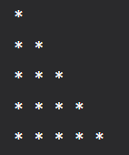

```cpp
//Using For-Loop.
#include<iostream>
using namespace std;

int main()
{
    for(int  i =0; i < 5; i++)
    {
        for(int j = 0; j < i+1; j++)
        {
            cout << "*" << " ";
        }
        cout << endl;
    }
    return 0;
}

//Using While-Loop.
#include<iostream>
using namespace std;

int main()
{
    int i = 0;
    while(i < 5)
    {
        int j = 0;
        while (j < i+1)
        {
           cout << "*" << " ";
           j++;
        }        
        cout << endl;
        i++;
    }
    return 0;
}
```

<h2 id = "02">Program-02</h2>

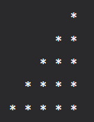

```cpp
//Using the For-Loop
#include<iostream>
using namespace std;

int main()
{
    for(int i = 0; i < 5; i++)
    {
        for(int j =  0; j < 5; j++)
        {
            if( j < 5- (i+1)){
                cout << " ";
            }

            else{
                cout << "*";
            }            
        }

        cout<<endl;
    }
    return 0;
}


//Using the While-Loop
#include<iostream>
using namespace std;

int main()
{
    int i = 0;
    while(i < 5){
        int j = 0;
        while(j < 5){
            if(j < 5-(i+1)){
                cout << " ";
            }
            
            else{
                cout << "*";
            }
            
            j++;
        }
        cout<<endl;
        i++;
    }
    return 0;
}
```

<h2 id = "03">Program-03</h2>

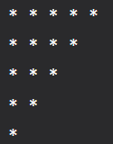

```cpp
//Using For-Loop
#include<iostream>
using namespace std;

int main()
{
    for(int  i = 0; i < 5; i++ )
    {
        for(int j = 5-i; j > 0; j--)
        {
            cout << "*";
        }

        cout << endl;
    }
    return 0;
}


//Using While-Loop
#include<iostream>
using namespace std;

int main()
{
    int i = 0;
    while(i < 5)
    {
        int j = 5-i;
        while(j > 0)
        {
            cout << "*";
            j--;
        }
        cout << endl;
        i++;
    }
    return 0;
}
```
<h2 id = "04">Program-04</h2>

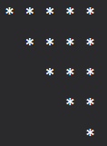

```cpp
//Using the For-Loop
#include<iostream>
using namespace std;

int main()
{
    for(int i = 0; i < 5; i++)
    {
        for(int j = 0; j < 5; j++)
        {
            if(j >= i){
                cout << "*";
            }

            else{
                cout << " ";
            }
        }
        cout << endl;
    }
    return 0;
}


//Using the While-Loop
#include<iostream>
using namespace std;

int main()
{
    int i = 0;
    while(i < 5)
    {
        int j = 0;
        while (j < 5)
        {
            if(j >= i){
                cout << "*";
            }

            else{
                cout << " ";
            }
            j++;
        }
        
        cout << endl;
        i++;
    }
    return 0;
}
```

<h2 id = "05">Program-05</h2>

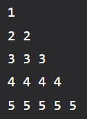

```cpp
//Using the For-Loop
#include<iostream>
using namespace std;

int main()
{
    for(int i = 0; i < 5; i++)
    {
        for(int j = 0; j < i+1; j++)
        {
            cout << (i+1) << " ";
        }

        cout << endl;
    }
    return 0;
}


//Using the While-Loop
#include<iostream>
using namespace std;

int main()
{
    int i = 0;
    while(i < 5)
    {
        int j = 0;
        while(j < i+1)
        {
            cout << (i+1);
            j++;
        }
        cout << endl;
        i++;
    }
}
```

<h2 id = "06">Program-06</h2>

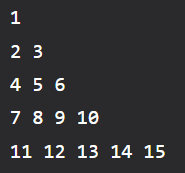

```cpp
//Using For-Loop.
#include<iostream>
using namespace std;

int main()
{
    int i = 0;
    int k = i+1;
    
    for(i; i < 5; i++)
    {        
        for(int  j = 0; j < i+1 ; j++)
        {
            cout << k++ << " ";
        }
        cout << endl;
    }
    return 0;
}


//Using While-Loop.
#include<iostream>
using namespace std;

int main()
{
    int i = 0;
    int  k = (i+1);

    while(i < 5)
    {
        int j = 0;
        while(j < i+1)
        {
            cout << k++ << " "; 
            j++;
        }
        cout << endl;
        i++;
    }

    return 0;
}
```

<h2 id = "07">Program-07</h2>

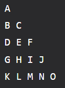

```cpp
//Using For-Loop.
#include<iostream>
using namespace std;

int main()
{
    char c = 'A';
    for(int  i = 0; i < 5; i++)
    {
        for(int j = 0; j < i+1; j++)
        {
            cout << c++ << " ";
        }
        cout << endl;
    }
    return 0;
}


//Using while-Loop.
#include<iostream>
using namespace std;

int main()
{
    char c = 'A';
    int i = 0;
    while(i < 5)
    {
        int j = 0;
        while(j < i+1)
        {
            cout << c++ << " ";
            j++;
        }
        cout << endl;
        i++;
    }
    return 0;
}
```

<h2 id = "08">Program-08</h2>

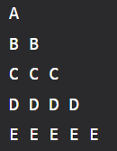

```cpp
//Using For-Loop
#include<iostream>
using namespace std;

int main()
{
    char c = 'A';
    for(int i = 0; i < 5; i++)
    {
        for(int j = 0; j < i+1; j++)
        {
            cout << c << " ";
        }
        cout << endl;
        c++;
    }
  
    return 0;
}

//Using While-Loop
#include<iostream>
using namespace std;

int main()
{
    char c = 'A';
    int i = 0;
    while(i < 5)
    {
        int j = 0;
        while(j < i+1)
        {
            cout << c << " ";
            j++;
        }
        cout << endl;
        c++;
        i++;
    }
    return 0;
}
```

<h2 id = "09">Program-09</h2>

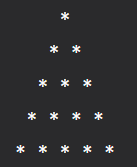

```cpp
//Using For-Loop.
#include<iostream>
using namespace std;

int main()
{
    for(int i = 0; i < 5; i++)
    {
        for(int j =  0; j < 5; j++)
        {
            if( j < 5- (i+1)){
                cout << " ";
            }

            else{
                cout << "*" <<" ";
            }            
        }

        cout<<endl;
    }
    return 0;
}

//Using The While-Loop.
#include<iostream>
using namespace std;

int main()
{
    int i = 0;
    while (i < 5)
    {
        int  j = 0;
        while (j < 5)
        {
            if(j < 5-(i+1)){
                cout << " ";
            }

            else{
                cout << "*" <<" ";
            }

            j++;
        }
        
        i++;
        cout << endl;
    }
    
    return 0;
}
```

<h2 id = "10">Program-10</h2>

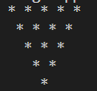

```cpp
//Using For-Loop.
#include<iostream>
using namespace std;

int main()
{
    for(int i = 0; i < 5; i++)
    {
        for(int j = 0; j < 5; j++)
        {
            if(j < i){
                cout << " ";
            }

            else{
                cout << "*" << " ";
            }
        }
        cout << endl;
    }
    return 0;
}

//Using While-Loop.
#include<iostream>
using namespace std;

int main()
{
    int i = 0;
    while(i < 5)
    {
        int j = 0;
        while (j < 5)
        {
            if(j >= i){
                cout << "*" << " ";
            }

            else{
                cout << " ";
            }
            j++;
        }
        
        cout << endl;
        i++;
    }
    return 0;
}
```
<h2 id = "11">Program-11</h2>

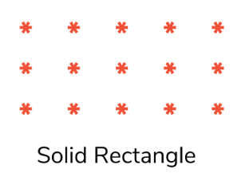

```cpp

//Using For-Loop
#include<iostream>
using namespace std;

int main()
{
    for(int i = 0; i < 5; i++)
    {
        for(int j = 0; j < 5; j++)
        {
            cout << "* ";
        }
        cout << endl;
    }
    return 0;
}   

//Using While-Loop
#include<iostream>
using namespace std;

int main()
{
    int i = 0;
    while(i <5)
    {
        int j = 0;
        while(j < 5)
        {
            cout << "* ";    
            j++;        
        }

        i++;
        cout << endl;
    }
    return 0;
}
```
<h2 id = "12">Program-12</h2>

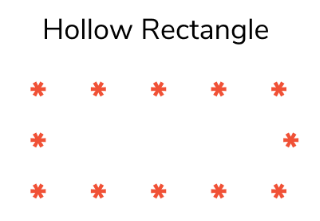

```cpp
// Using For-Loop
#include<iostream>
using namespace std;

int main()
{
    for(int i = 0; i < 5; i++)
    {
        for(int  j = 0; j < 5; j++ )
        {
            if(i == 0 || i == 4)
            {
                cout << "* ";       //one space is provided after each character print.
            }

            else{
                if(j == 0 || j == 4)
                {
                    cout << "* ";     //one space is provided after each character print.
                }

                else{
                    cout << "  ";   //two spaces are provided here (Similar to above situation where one space is provided after each character print)
                }
            }
        }

        cout << endl;
    }
    return 0;
}

//Using While-Loop
#include<iostream>
using namespace std;

int main()
{
    int i = 0;
    while(i < 5)
    {
        int  j = 0;
        while(j < 5) 
        {
            if(i == 0 || i == 4)
            {
                cout << "* ";
            }

            else{
                if(j == 0 || j == 4)
                {
                    cout << "* ";
                }

                else{
                    cout << "  ";
                }
            }
            j++;             
        }

        i++;
        cout << endl;
    }
    return 0;
}

```

<h2 id = "13">Program-13</h2>

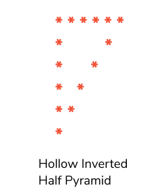

```cpp
// USing For-Loop
#include<iostream>
using namespace std;

int main()
{
    for(int i = 0; i < 5; i++)
    {
        for(int j = 0; j <= (4-i); j++)
        {
            if(i == 0 || i == 4)
            {
                cout << "* ";
            }

            else{
                if(j == 0 || j == (4-i))
                {
                    cout << "* ";
                }

                else{
                    cout << "  ";
                }
            }
        }
        cout << endl;
    }
    return 0;
}

// Using While-Loop
#include<iostream>
using namespace std;

int main()
{
    int i = 0;
    while(i < 5)
    {
        int j = 0;
        while(j <= (4-i))
        {
            if(i == 0 || i == 4)
            {
                cout << "* ";
            }

            else{
                if(j == 0 || j == (4-i))
                {
                    cout << "* ";
                }

                else{
                    cout << "  ";
                }
            }

            j++;
        }
        i++;
        cout << endl;
    }
    return 0;
}
```
<h2 id = "14">Program-14</h2>

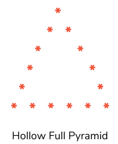
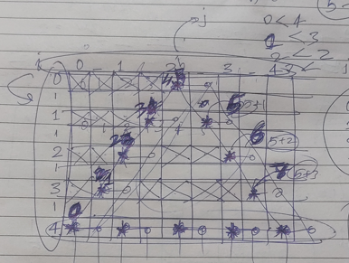

```cpp
// Using For-Loop
#include<iostream>
using namespace std;

int main()
{
    for(int i = 0; i < 5; i++)
    {
        for(int j = 0; j < 9; j++)
        {

                if( j < 5 && i == 4)          //for printing the last line only
                {
                    cout << "* ";
                }

                else if(j == (5-(i+1)) && i < 4)         //For Printing the first line and first stars
                {
                    cout << "*";
                }

                else if(j == (4+i) && i > 0 && i != 4){  //for printing the last stars 
                    cout << "*";                   
                }
                       

                else{
                    cout << " ";            //For Printing the spaces in front and creating hollow inside the pyramid
                }
            }
        
        cout << endl;
    }
    return 0;
}

// Uing While-Loop

#include<iostream>
using namespace std;

int main()
{
    int  i = 0;
    while(i < 5)
    {
        int j = 0;
        while(j < 9)
        {
            if(j < 5 && i == 4)     //For Printing the Last line only.
            {
                cout << "* ";
            }

            else if(j == (5-(i+1))&& i < 4)   //For Printing the first line and first stars.
            {
                cout << "*";
            }

            else if(j == (4+i) && i > 0 && i != 4)      //For printing the last stars.
            {
                cout << "*";
            }

            else{                   //For printing the spaces in front and in the hollow space inside the pyramid.
                cout << " ";
            }
            j++;
        }
        i++;
        cout << endl;
    }
    return 0;
}


```


<h2 id = "15">Program-15</h2>

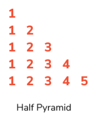

```cpp
// Using For-Loop
#include<iostream>
using namespace std;

int main()
{
    for(int i = 0; i < 5; i++)
    {
        for(int j = 0; j < i; j++)
        {
            cout << (j+1) << " ";
        }
        cout << endl;
    }
    return 0;
}

//Using While-Loop
#include<iostream>
using namespace std;

int main()
{
    int i = 0;
    while(i < 5)
    {
        int j = 0;
        while(j < i+1)
        {
            cout << (j+1) << " ";
            j++;
        }
        i++;
        cout << endl;
    }
    return 0;
}
```

<h2 id = "16">Program-16</h2>

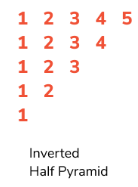

```cpp
// Using the For-Loop
#include<iostream>
using namespace std;

int main()
{
    for(int i = 0; i < 5; i++)
    {
        for(int j = 0; j < (5-i); j++)
        {
            cout << (j+1) << " ";
        }

        cout << endl;
    }
    return 0;
}

// Using the While-Loop
#include<iostream>
using namespace std;

int main()
{
    int i = 0;
    while(i < 5)
    {
        int j = 0;
        while(j < (5-i))
        {
            cout << (j+1) << " ";
            j++;
        }
        i++;
        cout <<endl;
    }
    return 0;
}
```
<h2 id = "17">Program-17</h2>

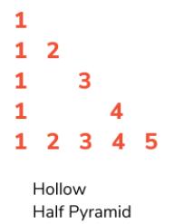
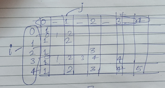

```cpp
// Using the For-Loop
#include<iostream>
using namespace std;

int main()
{
    for(int i = 0; i < 5; i++)
    {
        for(int j = 0; j < 9; j++)
        {
            if(j < 5 && i == 4)     //For printing the Last Line only.
            {
                cout << (j+1) << " ";
            }

            else if(j == 0  && i != 4)          //For printing the First Characters.
            {
                cout << (j+1);
            }

            else if(j == (2*i) && i > 0 && i != 4 )       //For printing the Last Characters.
            {
                cout << (i+1);
            }

            else{
                cout << " ";
            }
        }
        cout << endl;
    }
    return 0;
}

// Using While-Loop
#include<iostream>
using namespace std;

int main()
{
    int i = 0;
    while(i < 5)
    {
        int  j = 0;
        while(j < 9)
        {
            if(j < 5 && i == 4)        //For Printing the last line only.
            {
                cout << (j+1) << " ";
            }

            else if(j == 0 && i != 4)           //For Printing the first characters only. 
            {
                cout << (j+1);
            }

            else if(j == (2*i) && i > 0 && i != 4)       //For Printing the last characters only.
            {
                cout << (i+1);
            }

            else{
                cout << " ";
            }
            j++;
        }
        i++;
        cout <<endl;
    }
    return 0;
}
```
<h2 id = "18">Program-18</h2>

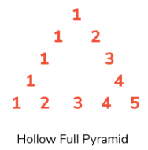
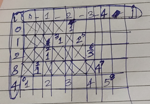

```cpp
// Using For-Loop
#include<iostream>
using namespace std;

int main()
{
    for(int i = 0; i < 5; i++)
    {
        for(int j = 0; j < 9; j++)
        {
            if(i == 4 && j < 5)    //For printing the last line only.
            {
                cout << (j+1) << " ";
            }

            else if(j == (5-(i+1)) && i != 4)   //For Printing the First Characters.
            {
                cout << "1";
            }

            else if(j == (4+i) && i > 0 && i != 4)   //For Printing the Last Characters.
            {
                cout << (i+1);
            }

            else{
                cout << " ";        //For printing the space infront and for creating the hollow inside.
            }
        }
        cout << endl;
    }
    return 0;
}

// using While-Loop

#include<iostream>
using namespace std;

int main()
{
    int i = 0; 
    while(i < 5)
    {
        int j = 0;
        while(j < 9)
        {
            if(j < 5 && i == 4)        //For Printing Last Line only.
            {
                cout << (j+1) << " ";
            }

            else if(j == (5-(i+1)) && i != 4)       //For Printing the First Characters.
            {
                cout << "1";
            }

            else if(j == (4+i) && i > 0 && i != 4)       //For Printing the Last Characters.
            {
                cout << (i+1);
            }

            else{               //For Printing the Space infront and creating hollow inside of the pyramid.
                cout << " ";
            }
            j++;
        }
        i++;
        cout <<endl;
    }
    return 0;
}
```
