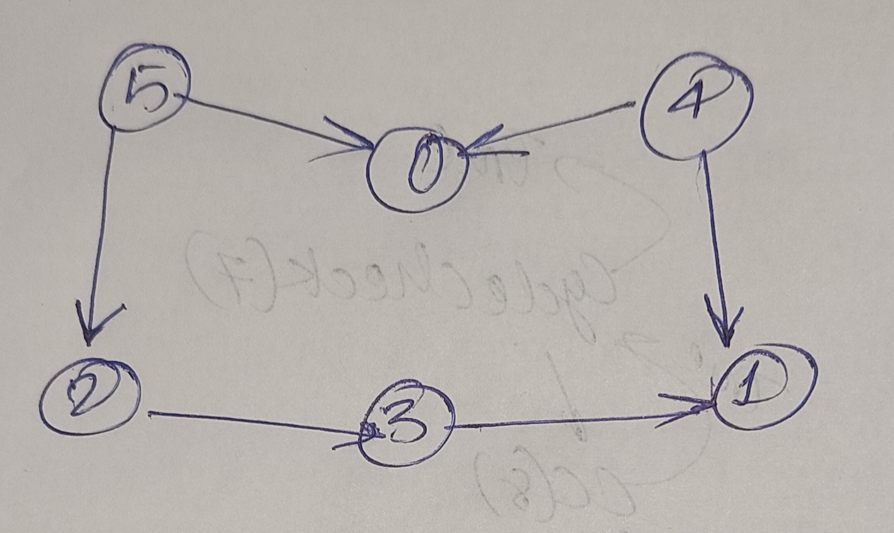

<a href = "#01">Question 01 - Cycle Detection in Undirected graph (using BFS)</a> <br>
<a href = "#02">Question 02 - Cycle Detection in Undirected graph (using DFS)</a> <br>
<a href = "#03">Question 03 - Bipartite Detection in Undirected graph (using DFS)</a> <br>
<a href = "#04">Question 04 - Cycle Detection in Directed graph (using DFS)</a> <br>
<a href = "#05">Question 05 - Topological Sort (only possible in Directed Acyclic Graph)</a> <br>

<h2 id = "01">Question 01 - Cycle Detection in Undirected graph (using BFS)</h2>


```cpp
#include<bits/stdc++.h>
using namespace std;

class Graph
{
private:
    int numNode;            //represents the no. of nodes in the graph
    vector<int> *adjList;

public:
    Graph(int numNode);

    void addEdge(int src, int des);

    void print();

    bool checkCycle();
    bool checkCycleUtils(int node, vector<int> &vis, vector<int> adjList[]);
};


Graph :: Graph(int numNode)
{
    this->numNode = numNode;
    adjList = new vector<int>[numNode + 1];         //as soon as we will be given the number of nodes(i.e. numNode) in the graph the adjacency-list of size (numNode+1) will be created
}

bool Graph :: checkCycleUtils(int node, vector<int> &vis, vector<int> adjList[])
{
    queue<pair<int,int>> q;
    q.push({node, -1});
    vis[node] = 1;

    while (q.empty() == false)
    {
        int curr = q.front().first;
        int pre = q.front().second;

        q.pop();

        for(int adjNode : adjList[curr])
        {
            if(vis[adjNode] == 0)
            {
                vis[adjNode] = 1;
                q.push({adjNode,curr});
            }

            else if(pre != adjNode)
            {
                return true;
            }
        }
    }   
    
    return false;
}


bool Graph :: checkCycle()
{
    vector<int> vis(numNode + 1, 0);

    for(int i = 1; i <= numNode; i++)
    {
        if(vis[i] == 0)
        {
            if(checkCycleUtils(i, vis, adjList) == true)
            {
                return true;
            }
        }
    }
    return false;
}


void Graph :: addEdge(int src, int des)
{
    adjList[src].push_back(des);
    adjList[des].push_back(src);
}


//Funcion to print the adjacency-List of the graph
void Graph :: print()
{
    for(int i = 0; i < (numNode + 1); i++)
    {
        for(int j : adjList[i])
        {
            cout << j <<" ";
        }
        cout<<endl;
    }
}


int main()
{
    Graph g(3);

    //Component C1 of the graph
    g.addEdge(1,2);
    g.addEdge(2,3);

    // //Component C2 of the graph
    // g.addEdge(3,5);
    // g.addEdge(5,10);
    // g.addEdge(5,6);
    // g.addEdge(6,7);
    // g.addEdge(10,9);
    // g.addEdge(7,8);
    // g.addEdge(9,8);
    // g.addEdge(8,11);


    g.print();

    if(g.checkCycle())
    {
        cout<<"Cycle exists"<<endl;
    }

    else{
        cout<<"Cycle do not exists"<<endl;
    }


    return 0;
}
```

<h2 id = "02">Question 02 - Cycle Detection in Undirected graph (using DFS)</h2>

```cpp
#include<bits/stdc++.h>
using namespace std;

class Graph
{
private:
    int numNode;            //represents the no. of nodes in the graph
    vector<int> *adjList;

public:
    Graph(int numNode);

    void addEdge(int src, int des);

    void print();

    bool checkCycle();
    bool checkCycleUtils(int node,int pre, vector<int> &vis, vector<int> adjList[]);
};


Graph :: Graph(int numNode)
{
    this->numNode = numNode;
    adjList = new vector<int>[numNode + 1];         //as soon as we will be given the number of nodes(i.e. numNode) in the graph the adjacency-list of size (numNode+1) will be created
}

bool Graph :: checkCycleUtils(int node,int pre, vector<int> &vis, vector<int> adjList[])
{
   vis[node] = 1;

   for(int adjNode : adjList[node])
   {
       if(vis[adjNode] == 0)
       {
           if(checkCycleUtils(adjNode,node,vis,adjList) == true)
           {
               return true;
           }
       }

       else if(adjNode != pre)
       {
           return true;
       }
   }
   return false;
}


bool Graph :: checkCycle()
{
    vector<int> vis(numNode + 1, 0);

    for(int i = 1; i <= numNode; i++)
    {
        if(vis[i] == 0)
        {
            if(checkCycleUtils(i,-1, vis, adjList) == true)
            {
                return true;
            }
        }
    }
    return false;
}


void Graph :: addEdge(int src, int des)
{
    adjList[src].push_back(des);
    adjList[des].push_back(src);
}


//Funcion to print the adjacency-List of the graph
void Graph :: print()
{
    for(int i = 0; i < (numNode + 1); i++)
    {
        for(int j : adjList[i])
        {
            cout << j <<" ";
        }
        cout<<endl;
    }
}


int main()
{
    Graph g(3);

    //Component C1 of the graph
    g.addEdge(1,2);
    g.addEdge(2,3);

    // //Component C2 of the graph
    // g.addEdge(3,5);
    // g.addEdge(5,10);
    // g.addEdge(5,6);
    // g.addEdge(6,7);
    // g.addEdge(10,9);
    // g.addEdge(7,8);
    // g.addEdge(9,8);
    // g.addEdge(8,11);


    g.print();

    if(g.checkCycle())
    {
        cout<<"Cycle exists"<<endl;
    }

    else{
        cout<<"Cycle do not exists"<<endl;
    }


    return 0;
}
```

<h2 id = "03">Question 03 - Bipartite Detection in Undirected graph (using DFS)</h2>

```cpp
#include<bits/stdc++.h>
using namespace std;

bool bipartiteDfs(int node, vector<int> &color, vector<int> adjList[])
{
    if(color[node] == -1){
        color[node] = 1;
    }
    
    for(int adjNode : adjList[node])
    {
        if(color[adjNode] == -1)
        {
            color[adjNode] = 1 - color[node];

            if(bipartiteDfs(adjNode, color, adjList) == false){
                return false;
            }
        }

        else if(color[adjNode] == color[node]){
            return false;
        }
    }
    return true;   
}

bool checkBipartite(vector<int> adjList[], int numNode)
{
    vector<int> color(numNode + 1, -1);


    for(int i = 1; i <= numNode; i++)
    {
        if(color[i] == -1)
        {
            if(bipartiteDfs(i, color, adjList)){
                return true;
            }
        }
    }

    return false;
}

int main()
{

    int n, m;           //n - no. of vertices or nodes
    cin >> n >> m;      //m - no. of edges


    //declaring the adjacency list
    vector<int> adjList[n+1];           //'array of vector' - each element of this array is a vector.


    //taking edges as input and storing it in the adjacency list
    for(int i = 0; i<m; i++)
    {
        int u, v;           //u and v represents the end vertices of any edge
        cin >> u >> v;

        adjList[u].push_back(v);
        adjList[v].push_back(u);
    }


    //Calling the checkBipartite function for the garph(adjacency List)
    if(checkBipartite(adjList, n))
    {
        cout<<"The Graph is Bipartite"<<endl;
    }

    else{
        cout<<"The Graph is not Bipartite"<<endl;
    }

    return 0;
}
```
<h2 id = "04">Question 04 - Cycle Detection in Directed graph (using DFS)</h2>

```cpp
#include<bits/stdc++.h>
using namespace std;

bool checkCycleDfs(int node, vector<int> &vis, vector<int> &dfsVis, vector<int> adjList[])
{
    vis[node] = 1;
    dfsVis[node] = 1;

    for(int adjNode : adjList[node])
    {
        if(vis[adjNode] == 0){
            if(checkCycleDfs(adjNode, vis, dfsVis, adjList) == true){
                return true;
            }
        }

        else if(dfsVis[adjNode] == 1){
            return true;
        }
    }

    dfsVis[node] = 0;
    return false;
}

bool checkCycle(vector<int> adjList[], int numNodes)
{
    vector<int> vis(numNodes + 1, 0);
    vector<int> dfsVis(numNodes + 1, 0);

    for(int i = 1; i <= numNodes; i++)
    {
        if(vis[i] == 0)
        {
            if(checkCycleDfs(i, vis, dfsVis, adjList) == true){
                return true;
            }            
        }
    }
    return false;
}

int main()
{
    int n, m;       //n - no. of vertices
    cin >> n >> m;  //m - no. of edges

    //declaring the adjacency list
    vector<int> adjList[n+1];

    //taking edges as input and storing it in the adjacency list
    for(int i = 0; i<m; i++)
    {
        int u, v;            //u and v represents the end vertices of any edge
        cin >> u >> v;

        adjList[u].push_back(v);
    }

    
    //Calling the checkCycle function for the garph(adjacency List)
    if(checkCycle(adjList, n))
    {
        cout<<"The Graph contains a Cycle"<<endl;
    }

    else{
        cout<<"The Graph  does not contains a Cycle"<<endl;
    }

    return 0;
}
```

<h2 id = "05">Question 05 - TopoLogical Sort (only possible in Directed Acyclic Graph)</h2>



```cpp

#include<bits/stdc++.h>
using namespace std;

void topoSortDfs(int node, vector<int> &vis, vector<int> adjList[], stack<int> &s)
{
    vis[node] = 1;

    for(int adjNode : adjList[node])
    {
        if(vis[adjNode] == 0){
            topoSortDfs(adjNode, vis, adjList, s);
        }
    }

    s.push(node);
}

vector<int> topoSort(vector<int> adjList[], int numNodes)
{
    stack<int> s;
    vector<int> vis(numNodes, 0);

    for(int i = 0; i < numNodes; i++)
    {
        if(vis[i] == 0)
        {
            topoSortDfs(i, vis, adjList, s);
        }
    }

    vector<int> topoSortValue;

    while(s.empty() == false)
    {
        int value = s.top();
        topoSortValue.push_back(value);
        s.pop();
    }

    return topoSortValue;
}

int main()
{
    int n, m;       //n - no. of vertices or nodes
    cin >> n >> m;  //m - no. of edges

    //declaring the adjacency list
    vector<int> adjList[n+1];

    //taking edges as input and storing it in the adjacency list
    for(int i = 0; i<m; i++)
    {
        int u, v;            //u and v represents the end vertices of any edge
        cin >> u >> v;

        adjList[u].push_back(v);
    }

    for(int &value : topoSort(adjList, n))
    {
        cout << value <<" ";
    }
    cout<<endl;


    return 0;
}
```